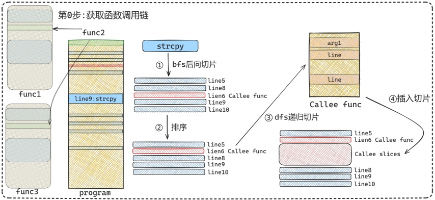

# Gen_slice

> 代码写的不是很好，仅供大家参考。

## 1、使用说明

该脚本首先会定位源代码中的危险函数，然后对其进行切片，示意图如下所示。


本系统能够接收`C`、`Cpp`源文件，当输入`C`、`Cpp`源文件时，可以查找源文件中的相关危险函数，同时对危险函数进行前向和后向的切片，具体切片过程如下图所示。首先系统会通过`Joern`对输入的源程序进行解析，以`JSON`的形式导出`CPG`图，以`dot`的形式导出`PDG`图，然后根据给定的黑名单，搜索相关的危险函数，比如`strcpy`、`sprintf`等会导致栈溢出的函数，确定好切片的起始点之后，切片程序会执行图遍历算法，通过广度优先遍历和深度优先遍历，得到与危险函数数据相关或者控制相关的代码行号（对应于图的第①步），之后会将行号进行排序（对应于第②步），如果相关的行号包含了对外部函数的引用（库函数除外），如图中的`Callee func`，则系统会在该函数内部进行切片（对应于图第③步），随后将切好的代码插入到原切片对应函数行号的后面（对应于图第④步），最后会返回所有函数的切片，如此便形成了一个完整的切片过程。不过考虑到func2函数会被func1函数和func3函数调用，所有需要再func1和func2中进行切片，为了简化算法，只需要在之前生成函数调用链即可（对应于第0步）。




## 2、使用方法

1. 首先git

```
git clone https://github.com/glkfc/gen_slice.git
```

2. 然后下载`joern`，并将`joern-cli`解压后放到主目录（和`data_process`文件夹同级）

```
https://github.com/joernio/joern/releases/download/v2.0.195/joern-cli.zip
```

3. 进行切片

```
python gen_slice.py example.c
```


## 3、使用示例

对`a.c`进行切片

```
python gen_slice.py ../data/test_c/a.c
```

```c
void println(const char * ln)
{
  if(ln != NULL)
  printf("%s\n", ln);
}

void func()
{
  char *data;
  char dataBuffer[100];
  memset(dataBuffer, 'A', 99);
  dataBuffer[99] = '\0';
  while(1)
  {
    data = dataBuffer - 8;
    break;
  }
  println(data);
}
```

结果存储在`data/test/test_slices_a.txt`，结果如下，其中第一行表示相关信息，最后一行的2表示该切片**并未**判断为有漏洞或者无漏洞，可用于后续的神经网络模型检测。

```
serial number:0 vul_api_line:11 memset
void func()
char *data;
char dataBuffer[100];
memset(dataBuffer, 'A', 99);
data = dataBuffer - 8;
println(data);
2
```

