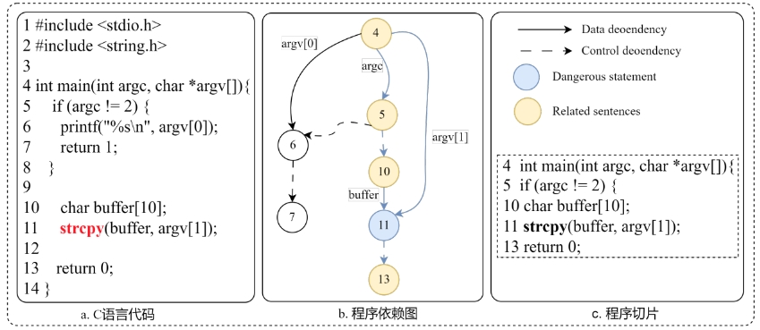

# Gen_slice

> 代码写的不是很好，仅供大家参考。

## 1、使用说明

该脚本首先会定位源代码中的危险函数，然后对其进行切片，示意图如下所示。



## 2、使用方法


首先git


然后下载joern


放到主目录


该脚本用于获取C语言源代码的切片

```
gen_slice.py example.c
```

example

```
python gen_slice.py ../data/test_c/a.c
```


结果存储在`data/test/test_slices_a.txt`

result

```
serial number:0 vul_api_line:11 memset
void func()
char *data;
char dataBuffer[100];
memset(dataBuffer, 'A', 99);
data = dataBuffer - 8;
println(data);
2
```

